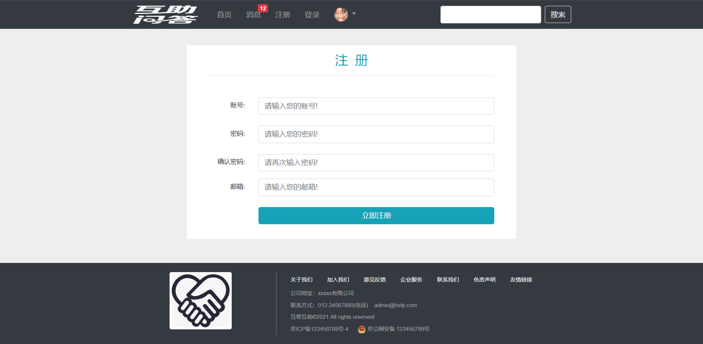

	

	
	
	
	
	
  

	
	
	
	
  

## 项目简介

这是一个校园互助平台，用户可以在这里发帖进行互帮互助。实现了平台的注册、登录、发帖、评论、回复、私信等功能，使用DFA实现敏感词过滤；使用 Spring Security 做权限控制；使用Quartz定时更新热门帖子；使用 Redis 实现点赞、关注与发帖限流；使用 Kafka 处理发送评论、点赞和关注等系统通知；使用 Elasticsearch 实现全文搜索。

## 系统架构

## 功能简介

- 使用 Redis 的 set 实现点赞，zset 实现关注，并使用 Redis 存储登录ticket和验证码，解决分布式 Session 问题，计划使用 Redis 的高级数据类型 HyperLogLog 统计 UV (Unique Visitor)，使用 Bitmap 统计 DAU (Daily Active User)（未实现）。
- 使用Redis Cell模块对用户发帖进行限流，防止恶意灌水。
- 使用 Kafka 处理发送评论、点赞、关注等系统通知、将新发布的帖子异步传输至Elasticsearch服务器，并使用事件进行封装，构建了强大的异步消息系统。
- 使用Elasticsearch做全局搜索，增加关键词高亮显示等功能。
- 使用 Quartz 定时更新热帖排行。
- 使用 Spring Security 做权限控制，替代拦截器的拦截控制，并使用自己的认证方案替代 Security 认证流程，使权限认证和控制更加方便灵活。

## 前端

## 后端

总结文档：[http://cocospace.top/2022/09/22/%E4%BA%92%E5%8A%A9%E5%B9%B3%E5%8F%B0%E5%BC%80%E5%8F%91%E6%80%BB%E7%BB%93/](http://cocospace.top/2022/09/22/互助平台开发总结/)
